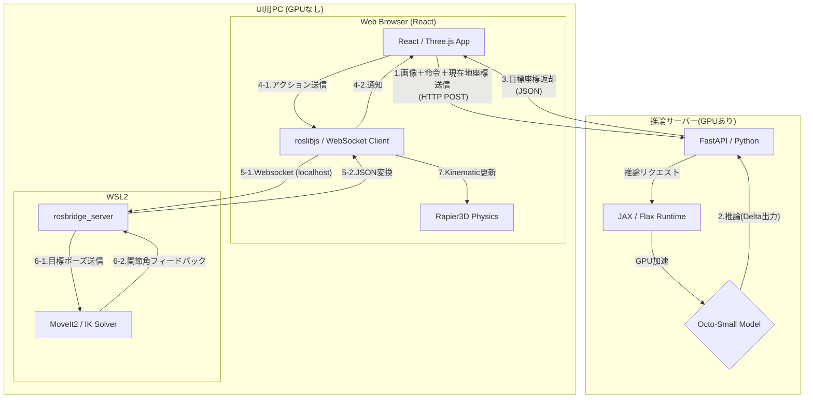
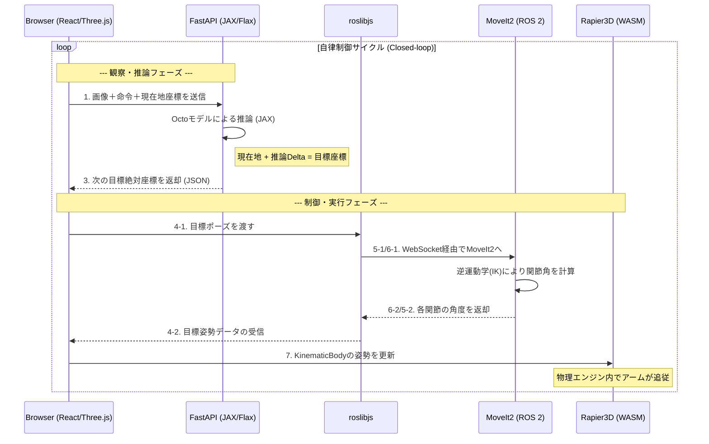
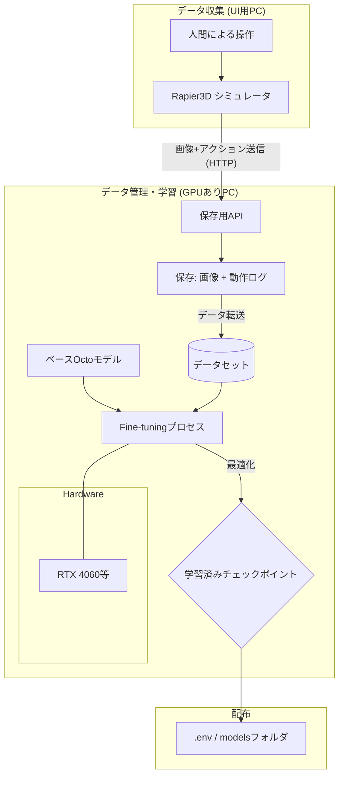
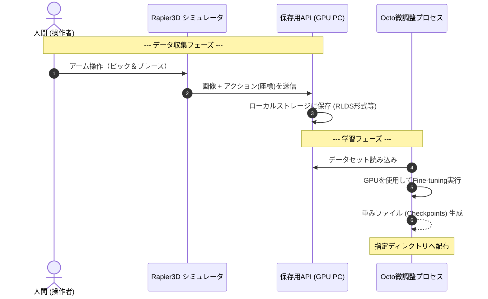

# vla-simulator

VLA（Vision-Language-Action）モデルの学習データ収集、および動作検証を、物理シミュレーション環境で行うためのシステム

## 1. はじめに

本プロジェクトは、高価な実機ロボットを使わずに、ブラウザ上の3D環境（Three.js + Rapier3D）とロボット制御フレームワーク（ROS 2 + MoveIt2）を連携させ、VLAモデルの検証サイクルを高速化することを目的としている。  
当初は巨大なLLMベースのVLAモデル（OpenVLA等）を想定していたが、現在は実行速度とリソースのバランスを考慮し、軽量かつ強力な **Octoモデル** を採用してリアルタイムな動作検証を実現している。

---

## 2. 動作検証時 (Inference Mode)

学習済みのLoRA重みを適用したVLAモデルを用いて、自律制御を行う。  
推論サーバーには同じネットワーク内のPCからアクセスすることが可能。

### 2.1 システム構成図



### 2.2 シーケンス図



---

## 3. 学習 (Training Mode)

人間がブラウザ上で操作したデータを収集し、GPUサーバーで Octo モデルの Fine-tuning（微調整）を行う。

### 3.1 システム構成図



### 3.2 シーケンス図



---

## 4. 技術要素 (Technology Stack)

* **UI / シミュレーション (検証用PC / Browser)**
    * **React / Three.js (React Three Fiber):** 3Dレンダリング
    * **Rapier3D:** WASMベースの物理エンジン。Kinematic制御によるアーム同期
    * **roslibjs:** ブラウザ ⇔ ROS 2 間のWebSocket通信ブリッジ
* **ロボット制御 (検証用PC / WSL2)**
    * **ROS 2 Humble:** ロボットミドルウェア基盤
    * **MoveIt2:** 逆運動学(IK)計算および軌道生成のコア
    * **rosbridge_suite:** JSON形式による外部通信用サーバー
    * **URDF / SRDF:** ロボットアームの物理構造・可動範囲の定義
* **AI推論・学習 (推論サーバー / GPU)**
    * **FastAPI:** 推論/学習データ収集用API
    * **Octo (JAX/Flax):** 基盤VLAモデル。軽量かつマルチモーダルな推論が可能
    * **ml_dtypes:** 低精度演算用ライブラリ
* **インフラ・管理**
    * **Docker / Docker Compose:** 推論環境のコンテナ化
    * **dotenv:** 環境変数管理 (URL, Port, ModelPath)

### ■ AI関連の主要用語解説

* **OpenVLA:**
  Llama 2等の大規模言語モデル（LLM）をベースに、画像入力とロボット操作出力を統合した**オープンな汎用基盤モデル**。  
  本システムでは当初このモデルを想定していた。
  
* **Octo:**
  トランスフォーマーベースの軽量かつ強力なVLA基盤モデル。複数のロボットデータセット（Bridge v2等）で事前学習されており、未知の環境でも高い適応能力を持つ。**本システムの現在の推奨モデル。**

* **JAX / Flax:**
  Googleが開発した高速な数値計算ライブラリ。Octoの実行エンジンとして使用され、GPU上で極めて効率的に動作する。

* **LoRA (Low-Rank Adaptation):**
  巨大なモデル全体を書き換えるのではなく、**少数の追加パラメータ（重み）のみを学習**させる手法。  
  低メモリ・短時間で特定のタスクを覚えさせることができる。
  
* **PEFT (Parameter-Efficient Fine-Tuning):**
  LoRAなどの「効率的な学習手法」を実装するためのライブラリ。  
  本システムでは、学習した複数の重みをサーバーを止めずに切り替えるために活用する。
  
* **bitsandbytes:**
  モデルの計算精度を落とす（4-bit量子化等）ことで、**消費VRAMを劇的に削減**する技術。  
  巨大なVLAモデルを一般的なゲーミングGPUで動作可能にする。

* **RLDS (Robot Learning Dataset Standard):**
  Google等が提唱する、ロボット学習データの標準的な保存形式。Octoなどの最新モデルの学習に広く用いられている。

### ■ フィジカル関連の主要用語解説

* **WASM (WebAssembly):**
    ブラウザ上でネイティブコードに近い速度でプログラムを実行するための技術。  
	Pythonなどの言語に比べ非常に高速なため、計算負荷の高い物理演算やリアルタイム制御をブラウザ内で実現するために使用する。

* **Rapier3D:**
    Rust言語で書かれ、WASMとして動作する**ブラウザ向けの高性能な物理エンジン**。  
    ロボットの関節の動きや物体との衝突判定をリアルタイムで計算し、シミュレーション空間に「重力」や「摩擦」を与える。
    
* **KinematicBody:**
    物理エンジン（Rapier3D）における物体の種類の一つ。重力や衝突の衝撃に左右されず、プログラムからの指令で正確に位置・姿勢を決定できる。本システムでは、ROS 2 からの関節角度データをアームの描画に反映するために使用している。

* **roslibjs:**
    ブラウザ（JavaScript）とROS 2を繋ぐための「架け橋」となるライブラリ。  
    WebSocketを通じてデータのやり取り（目標座標の送信や状態の受信）を可能にする。

* **ROS 2 (Robot Operating System 2):**
    ロボット制御の標準プラットフォーム。  
    個別のプログラム（ノード）を組み合わせて、メッセージ通信によって複雑なロボットシステムを構築するための土台となる。

* **MoveIt2:**
    ROS 2上で動作する、**ロボットアームの軌道計画（マニピュレーション）用フレームワーク**。  
    逆運動学（IK）を解いて各関節の角度を算出したり、障害物を避ける経路を計算したりする。

* **Closed-loop Control (閉ループ制御 / 自律制御サイクル):**
    「観察（画像キャプチャ）→思考（VLA推論）→実行（アーム移動）」を絶え間なく繰り返す制御方式。本システムでは、推論結果を即座にシミュレータへ反映し、再び画像を撮ることでループを形成している。

* **rosbridge_suite:**
    ROS 2のメッセージをJSON形式に変換し、WebSocket経由で外部（ブラウザ等）とやり取りするための**通信サーバー**。  

* **URDF / SRDF:**
    * **URDF (Unified Robot Description Format):** ロボットの形やリンクの長さ、可動域を定義した「設計図」。
    * **SRDF (Semantic Robot Description Format):** MoveIt2向けに、関節のグループ化や衝突判定のルールを記述するファイル。

---

## 5. インターフェース仕様

### 5.1 VLA推論API (HTTP POST)

* **Endpoint:** `POST /predict`
* **Parameters (Form-data):**
    * `image`: キャプチャ画像 (File)
    * `instruction`: 命令テキスト (string)
    * `current_x`, `current_y`, `current_z`: 現在の座標 (float)
    * `current_roll`, `current_pitch`, `current_yaw`: 現在の姿勢 (float)
    * `current_gripper`: 現在の開閉状態 (float, 0.0=閉, 1.0=開)
* **Response Body (JSON):**
    ```json
    {
      "x": float,
      "y": float,
      "z": float,
      "roll": float,
      "pitch": float,
      "yaw": float,
      "gripper": float
    }
    ```

### 5.2 ROS 2 共通トピック

| Topic名 | メッセージ型 | 内容 |
| :--- | :--- | :--- |
| `/vla/target_pose` | `geometry_msgs/PoseStamped` | VLAから出力された目標絶対座標 |
| `/vla/gripper_cmd` | `std_msgs/Float64` | グリッパーの開閉指令 (0.0=閉 〜 1.0=開) |
| `/joint_states` | `sensor_msgs/JointState` | シミュレータ上の現在関節角度（AppへのFB用） |

---

## 6. 環境構築

### 6.1 前提条件

| 項目 | 要件 | 備考 |
| :--- | :--- | :--- |
| **OS (UI用PC)** | Windows 11 + WSL2 (Ubuntu 22.04 LTS) | ROS 2とブラウザの共存環境 |
| **GPU (推論用)** | NVIDIA RTX 3060 / 4060 以上 (VRAM 8GB+) | Octo-Small の動作要件 |
| **CUDA** | CUDA 12.1以上 | JAX (GPU版) の動作要件 |

### 6.2 ソフトウェア・ランタイム

* **Frontend:** Node.js v18.0.0+ / npm (Viteによるビルド)
* **Backend (AI):** Python 3.10+ (JAX, Flax, octo-models, ml_dtypes)
* **Robotics:** ROS 2 Humble (WSL2上で動作)
* **Container:** Docker / Docker Compose (推論サーバーの環境分離・デプロイ用)

### 6.3 ディレクトリ構造

```text
vla-simulator/
├── .env                # 推論サーバーURL、モデルパス等の環境変数
├── docker-compose.yml  # 推論サーバー（FastAPI + CUDA）用
├── src/
│   ├── frontend/       # React + Three.js + roslibjs
│   │   ├── src/components/ # Rapier3Dの物理コンポーネント
│   │   └── src/hooks/      # roslibjsの通信フック
│   ├── backend/        # FastAPI + VLA Inference (JAX/Flax)
│   │   ├── main.py         # APIサーバー本体
│   │   ├── vla_model.py    # Octoモデル管理・推論ロジック
│   │   └── Dockerfile      # 推論環境用イメージ定義
│   └── robot/          # ROS 2 関連
│       ├── urdf/           # アームのモデル定義 (物理エンジンと共通)
│       └── moveit_config/  # MoveIt2の設定ファイル
├── datasets/           # 学習用ログ・画像の保存先 (git管理外)
└── README.md           # 本ドキュメント
```

---

## 7. 実装上の留意点 (Tips)

### 7.1 通信・ネットワーク設定

* **CORS:** 推論サーバーのFastAPIにおいて、UI用PCからのアクセスを許可すること（デフォルトでポート 8000 を使用）。
* **rosbridge:** WSL2上の `rosbridge_server` は `address:=0.0.0.0` を指定し、Windows側ブラウザからの接続を待ち受けること（デフォルトでポート 9090 を使用）。
* **Host解決:** 同一LAN内IPまたは `.env` に定義された固定URLを使用。
* **ブラウザの制約:** localhost以外（他PC）からブラウザでアクセスする場合、HTTPS化またはブラウザ設定による「安全でないオリジンからのカメラアクセス許可」が必要になる場合がある。

### 7.2 ロボット定義の同期

* **URDFの一貫性:** ブラウザ側の `Rapier3D` と、WSL2側の `MoveIt2` は全く同じURDFファイルを参照し、リンク名や可動範囲に齟齬がないようにすること。
* **座標系:** 右手系を採用。単位はメートル(m)およびラジアン(rad)で統一する。
* **グリッパー制御の正規化:** VLAモデルの出力（0.0=閉, 1.0=開）を、実際のロボットの指令値（例：把持幅 0.0m〜0.04m）へ適切にマッピングすること。
* **姿勢表現の変換:** UI 上では直感的な Euler 角（度数法 / RPY）を使用するが、ROS 2 への目標値送信時にはクォータニオン（四元数）への変換を行う。