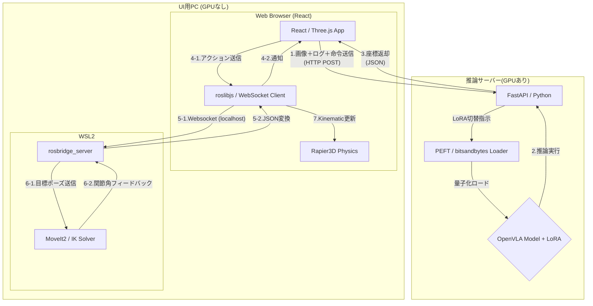
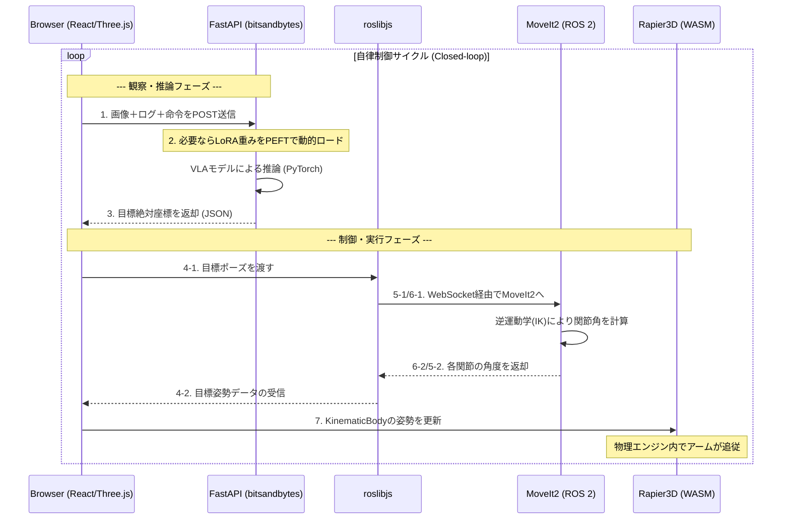
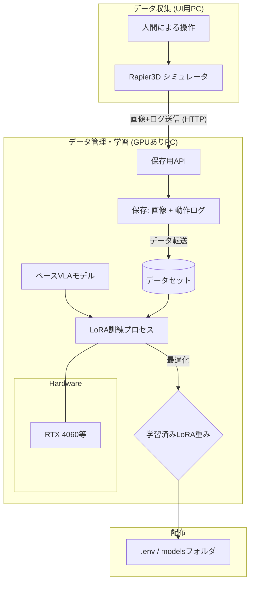
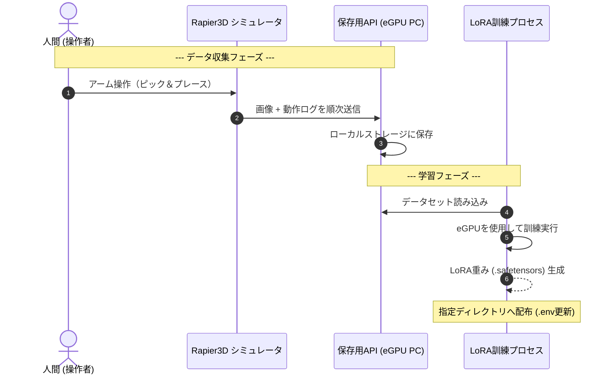

# vla-simulator

VLA（Vision-Language-Action）モデルの学習データ収集、および動作検証を、物理シミュレーション環境で行うためのシステム

## 1. はじめに

本プロジェクトは、高価な実機ロボットを使わずに、ブラウザ上の3D環境（Three.js + Rapier3D）とロボット制御フレームワーク（ROS 2 + MoveIt2）を連携させ、VLAモデルの検証サイクルを高速化することを目的としている。

---

## 2. 動作検証時 (Inference Mode)

学習済みのLoRA重みを適用したVLAモデルを用いて、自律制御を行う。

### 2.1 システム構成図



### 2.2 シーケンス図



> **※オンデマンド・ロードの仕組み**
> `bitsandbytes` により4-bit量子化されたベースモデルに対し、`PEFT` ライブラリを用いて学習済みアダプタ（LoRA）を動的にマウントする。  
> これにより、推論サーバーの再起動を伴わずに、異なるタスクへの適応をミリ秒単位で切り替えることが可能s。

---

## 3. 学習 (Training Mode)

人間がブラウザ上で操作したデータを収集し、eGPUサーバーでLoRA（Low-Rank Adaptation）学習を行う。

### 3.1 システム構成図



### 3.2 シーケンス図



---

## 4. 技術要素 (Technology Stack)

* **UI / シミュレーション (検証用PC / Browser)**
    * **React / Three.js (React Three Fiber):** 3Dレンダリング
    * **Rapier3D:** WASMベースの物理エンジン。Kinematic制御によるアーム同期
    * **roslibjs:** ブラウザ ⇔ ROS 2 間のWebSocket通信ブリッジ
* **ロボット制御 (検証用PC / WSL2)**
    * **ROS 2 Humble:** ロボットミドルウェア基盤
    * **MoveIt2:** 逆運動学(IK)計算および軌道生成のコア
    * **rosbridge_suite:** JSON形式による外部通信用サーバー
    * **URDF / SRDF:** ロボットアームの物理構造・可動範囲の定義
* **AI推論・学習 (推論サーバー / eGPU)**
    * **FastAPI:** 推論/学習データ収集用API
    * **OpenVLA / PyTorch:** ベースVLAモデルおよび推論エンジン
    * **PEFT / LoRA:** オンデマンドな重み付けロードと効率的な学習
    * **bitsandbytes:** 量子化によるVRAM節約技術
* **インフラ・管理**
    * **Docker / Docker Compose:** 推論環境のコンテナ化
    * **dotenv:** 環境変数管理 (URL, Port, ModelPath)

### ■ AI関連の主要用語解説

* **OpenVLA:**
  Llama 2等の大規模言語モデル（LLM）をベースに、画像入力とロボット操作出力を統合した**オープンな汎用基盤モデル**。  
  本システムではこのモデルを「脳」として利用する。
  
* **LoRA (Low-Rank Adaptation):**
  巨大なモデル全体を書き換えるのではなく、**少数の追加パラメータ（重み）のみを学習**させる手法。  
  低メモリ・短時間で特定のタスク（例：特定の物体を掴む）を覚えさせることができる。
  
* **PEFT (Parameter-Efficient Fine-Tuning):**
  LoRAなどの「効率的な学習手法」を実装するためのライブラリ。  
  本システムでは、学習した複数のLoRA重みを、サーバーを止めずに**オンデマンドで切り替える**ために活用する。
  
* **bitsandbytes:**
  モデルの計算精度を意図的に落とす（8-bitや4-bitへの量子化）ことで、**消費VRAMを劇的に削減**する技術。  
  これにより、本来は巨大なワークステーションが必要なVLAモデルを、一般的なゲーミングGPU（RTX 3060/4060等）で動作可能にする。

### ■ フィジカル関連の主要用語解説

* **WASM (WebAssembly):**
    ブラウザ上でネイティブコードに近い速度でプログラムを実行するための技術。  
	Pythonなどの言語に比べ非常に高速なため、計算負荷の高い物理演算やリアルタイム制御をブラウザ内で実現するために使用する。

* **Rapier3D:**
    Rust言語で書かれ、WASMとして動作する**ブラウザ向けの高性能な物理エンジン**。  
    ロボットの関節の動きや物体との衝突判定をリアルタイムで計算し、シミュレーション空間に「重力」や「摩擦」を与える。
    
* **roslibjs:**
    ブラウザ（JavaScript）とROS 2を繋ぐための「架け橋」となるライブラリ。  
    本来ブラウザからは直接触れないROS 2のと、WebSocketを通じてデータのやり取り（目標座標の送信や状態の受信）を可能にする。

* **ROS 2 (Robot Operating System 2):**
    ロボット制御の標準プラットフォーム。  
    個別のプログラム（ノード）を組み合わせて、メッセージ通信によって複雑なロボットシステムを構築するための土台となる。

* **MoveIt2:**
    ROS 2上で動作する、**ロボットアームの軌道計画（マニピュレーション）用フレームワーク**。  
    「この位置に手を移動させて」という命令に対し、関節がぶつからないような経路を計算したり、逆運動学（IK）を解いて各関節の角度を算出したりする。

* **rosbridge_suite:**
    ROS 2のメッセージをJSON形式に変換し、WebSocket経由で外部（ブラウザ等）とやり取りするための**通信サーバー**。  
    本システムでは、WSL2内で起動し、ブラウザの `roslibjs` からの指令をROS 2内部のコマンドへ翻訳する役割を担う。

* **URDF / SRDF:**
    * **URDF (Unified Robot Description Format):** ロボットの形やリンクの長さ、可動域をXML形式で定義した「設計図」。
    * **SRDF (Semantic Robot Description Format):** MoveIt2向けに、関節のグループ化（「アーム」や「ハンド」）や、衝突判定から除外する設定などを記述するファイル。

---

## 5. インターフェース仕様

### 5.1 VLA推論API (HTTP POST)

* **Endpoint:** `POST /predict`
* **Request Body (JSON):**
    ```json
    {
      "image": "base64_encoded_string",
      "instruction": "Red cubeを掴んで",
      "state": {
        "joint_positions": [0.0, -1.57, 1.57, 0.0, 0.0, 0.0],
        "gripper": 0.0
      }
    }
    ```
* **Response Body (JSON):**
    ```json
    {
      "action": [x, y, z, roll, pitch, yaw, gripper_width],
      "message": "success"
    }
    ```

### 5.2 ROS 2 共通トピック

| Topic名 | メッセージ型 | 内容 |
| :--- | :--- | :--- |
| `/vla/target_pose` | `geometry_msgs/PoseStamped` | VLAから出力された目標絶対座標 |
| `/joint_states` | `sensor_msgs/JointState` | シミュレータ上の現在関節角度（AppへのFB用） |
| `/display_planned_path`| `moveit_msgs/DisplayTrajectory` | MoveIt2が計算した予定軌道 |

---

## 6. 環境構築

### 6.1 前提条件

| 項目 | 要件 | 備考 |
| :--- | :--- | :--- |
| **OS (UI用PC)** | Windows 11 + WSL2 (Ubuntu 22.04 LTS) | ROS 2とブラウザの共存環境 |
| **OS (推論サーバ)** | Ubuntu 22.04 LTS | eGPU接続を想定 |
| **GPU (推論用)** | NVIDIA RTX 3060 / 4060 以上 (VRAM 12GB+) | LlamaベースのVLAモデル用 |
| **CUDA / cuDNN** | CUDA 12.1以上 | `bitsandbytes` (量子化) の動作要件 |

### 6.2 ソフトウェア・ランタイム

* **Frontend:** Node.js v18.0.0+ / npm (Viteによるビルド)
* **Backend (AI):** Python 3.10+ (PyTorch 2.1+, Transformers, PEFT, bitsandbytes)
* **Robotics:** ROS 2 Humble (WSL2上で動作)
* **Container:** Docker / Docker Compose (推論サーバーの環境分離・デプロイ用)

### 6.3 ディレクトリ構造

```text
vla-simulator/
├── .env                # 推論サーバーURL、モデルパス等の環境変数
├── docker-compose.yml  # 推論サーバー（FastAPI + CUDA）用
├── src/
│   ├── frontend/       # React + Three.js + roslibjs
│   │   ├── src/components/ # Rapier3Dの物理コンポーネント
│   │   └── src/hooks/      # roslibjsの通信フック
│   ├── backend/        # FastAPI + VLA Inference
│   │   ├── models/         # 学習済みLoRA重みの保存先
│   │   └── scripts/        # 訓練(LoRA)用スクリプト
│   └── robot/          # ROS 2 関連
│       ├── urdf/           # アームのモデル定義 (物理エンジンと共通)
│       └── moveit_config/  # MoveIt2の設定ファイル
├── datasets/           # 学習用ログ・画像の保存先 (git管理外)
└── README.md           # 本ドキュメント
```

---

## 7. 実装上の留意点 (Tips)

### 7.1 通信・ネットワーク設定

* **CORS:** 推論サーバーのFastAPIにおいて、UI用PCのIPアドレス（または `*`）からのアクセスを許可すること。
* **rosbridge:** WSL2上の `rosbridge_server` は `address:=0.0.0.0` を指定し、Windows側ブラウザからの接続を待ち受けること。
* **Host解決:** 検証用PCから推論サーバー（eGPU機）への接続は、同一LAN内IPまたは `.env` に定義された固定URLを使用すること。

### 7.2 ロボット定義の同期

* **URDFの一貫性:** ブラウザ側の `Rapier3D` と、WSL2側の `MoveIt2` は全く同じURDFファイルを参照し、リンク名や可動範囲に齟齬がないようにすること。
* **座標系:** 右手系を採用。単位はメートル(m)およびラジアン(rad)で統一する。