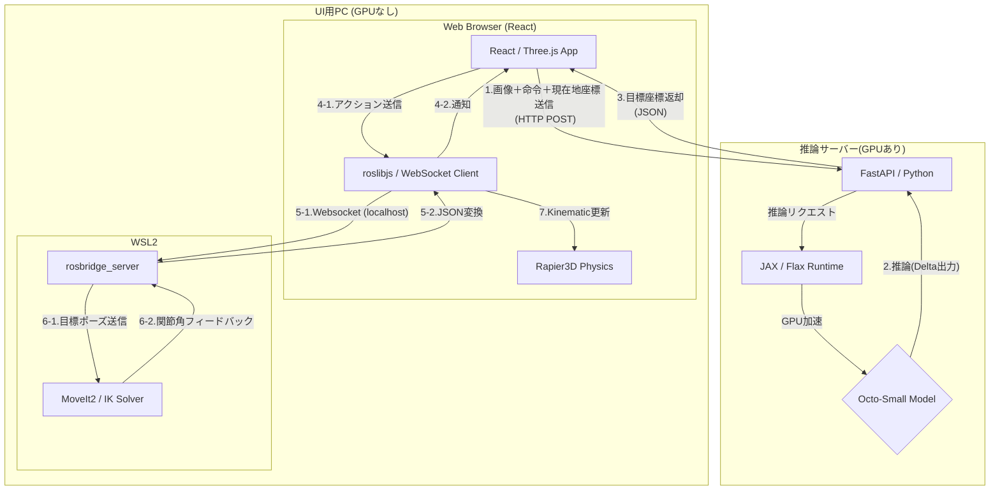
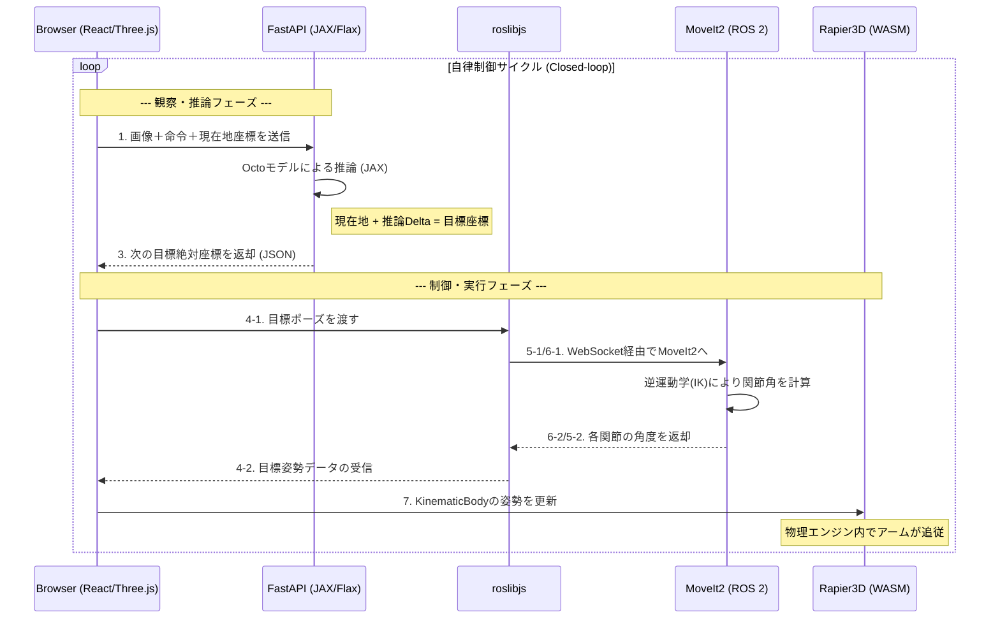
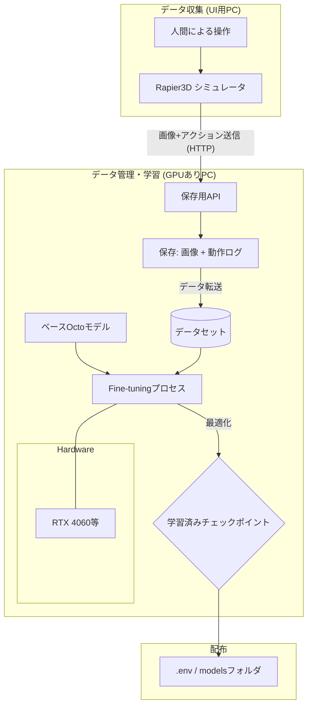
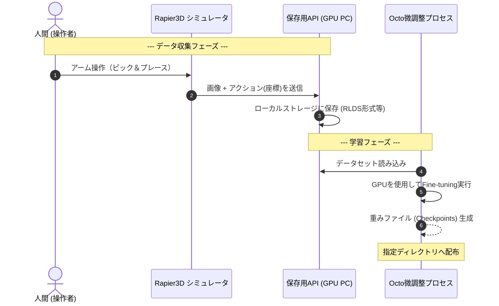

# vla-simulator

VLA（Vision-Language-Action）モデルの学習データ収集、および動作検証を、物理シミュレーション環境で行うためのシステム

---

## 目次

- [1. はじめに](#1-はじめに)
- [2. VLAモデルの基礎知識](#2-vlaモデルの基礎知識)
  - [2.1 VLA（Vision-Language-Action）モデルとは](#21-vlavision-language-actionモデルとは)
  - [2.2 VLAモデルの学習手法](#22-vlaモデルの学習手法)
  - [2.3 モデル選定と推奨ハードウェア要件](#23-モデル選定と推奨ハードウェア要件)
- [3. システムアーキテクチャと動作モード](#3-システムアーキテクチャと動作モード)
  - [3.1 全体概要](#31-全体概要)
  - [3.2 動作検証モード (Inference Mode)](#32-動作検証モード-inference-mode)
  - [3.3 データ収集・学習モード (Training Mode)](#33-データ収集学習モード-training-mode)
- [4. 技術スタックと用語解説](#4-技術スタックと用語解説)
  - [4.1 技術要素一覧](#41-技術要素一覧)
  - [4.2 AI関連の主要用語解説](#42-ai関連の主要用語解説)
  - [4.3 ロボティクス・物理シミュレーション関連の主要用語解説](#43-ロボティクス物理シミュレーション関連の主要用語解説)
- [5. インターフェース仕様](#5-インターフェース仕様)
  - [5.1 VLA推論API (HTTP POST)](#51-vla推論api-http-post)
  - [5.2 ROS 2 共通トピック](#52-ros-2-共通トピック)
- [6. 環境構築と起動手順](#6-環境構築と起動手順)
  - [6.1 前提条件](#61-前提条件)
  - [6.2 ソフトウェア・ランタイム](#62-ソフトウェアランタイム)
  - [6.3 ディレクトリ構造](#63-ディレクトリ構造)
  - [6.4 クイックスタート](#64-クイックスタート)
- [7. 実装・開発上の留意点 (Tips)](#7-実装開発上の留意点-tips)
  - [7.1 通信・ネットワーク設定](#71-通信ネットワーク設定)
  - [7.2 ロボット定義・座標系の同期](#72-ロボット定義座標系の同期)

---

## 1. はじめに

本プロジェクトは、高価な実機ロボットを使わずに、ブラウザ上の3D環境（Three.js + Rapier3D）とロボット制御フレームワーク（ROS 2 + MoveIt2）を連携させ、VLA（Vision-Language-Action）モデルの検証サイクルを高速化することを目的としたシステムである。  
当初は巨大なLLMベースのVLAモデル（OpenVLA等）を想定していたが、現在は実行速度とリソースのバランスを考慮し、軽量かつ強力な **Octoモデル** を採用してリアルタイムな動作検証を実現している。

---

## 2. VLAモデルの基礎知識

### 2.1 VLA（Vision-Language-Action）モデルとは

VLAモデルとは、カメラ等から得られる **「視覚情報 (Vision)」** と、人間からの **「自然言語の指示 (Language)」** を入力として受け取り、ロボットの関節角度や移動座標といった **「具体的な動作指令 (Action)」** を直接出力するエンドツーエンドのAIモデルである。  
従来のロボット制御が「物体認識」「軌道計画」「制御」といった複数の独立したモジュールを組み合わせていたのに対し、VLAモデルは巨大なニューラルネットワーク（多くは大規模言語モデル: LLMをベースとする）を用いて、これらを単一のモデルで完結させる点が特徴である。

### 2.2 VLAモデルの学習手法

VLAモデルの学習には、主に以下の手法が用いられる。本システムでは、このうち **模倣学習（Behavior Cloning）** のみを採用している。

* **模倣学習 (Behavior Cloning) [※本システムで採用]** :  
  人間が遠隔操作（テレオペレーション）などでロボットを動かした際の、「カメラ画像」「その時の指示テキスト」「実際に行ったアクション（関節角度や座標）」のセットを大量に記録し、それを正解データとしてAIに模倣させる手法である。本シミュレータの「データ収集・学習 (Training Mode)」はこのアプローチを前提としている。
* **強化学習 (Reinforcement Learning)** :  
  ロボットが試行錯誤を行い、タスクを達成できた際に「報酬」を与えることで、最適な行動を自律的に学習させる手法である（※本シミュレータでは現在スコープ外）。

### 2.3 モデル選定と推奨ハードウェア要件

VLAモデル（特にパラメータ数の多いモデル）の学習・推論には、強力なGPUが必要となる。

* **OpenVLA (7Bパラメータなど)**:  
  実行には多量のVRAM（最低でも16GB以上、4-bit量子化を駆使しても8〜10GB）を消費する。例えば `RTX 4060 (VRAM 8GB)` のような一般的なゲーミングPC環境では、OSやディスプレイ表示のメモリ消費があるため、VRAMに収まりきらず実行が困難（または極端に低速）となる。
* **Octo (1.5Bパラメータなど)**:  
  VRAM 2GB程度から動作する軽量モデルであり、`RTX 4060` のような環境でも非常に快適に推論・学習の検証が可能である。そのため、**本システムではデフォルトで Octo を採用**している。
* **CPUでの実行**:  
  GPUを搭載していないPCの場合、CPUのみでモデルを実行することも技術的には可能であるが、推論に非常に長い時間（数十秒〜数分/回）を要するため、リアルタイムな自律制御の検証には不向きである。

---

## 3. システムアーキテクチャと動作モード

### 3.1 全体概要

本システムは、ブラウザ上の3Dシミュレータ（React / Three.js / Rapier3D）、ロボット制御ミドルウェア（ROS 2 / MoveIt2）、およびAI推論・学習バックエンド（FastAPI / JAX / Octo）で構成される。  
「動作検証モード (Inference Mode)」と「データ収集・学習モード (Training Mode)」の2つの主要なワークフローを提供する。

### 3.2 動作検証モード (Inference Mode)

学習済みの重みを適用したVLAモデルを用いて、ブラウザ上のシミュレーション環境でロボットアームの自律制御を行う。  
推論サーバーには同一ネットワーク内のPCからアクセス可能である。

#### システム構成図


```mermaid
graph TD
    %% --- 物理境界 1: 検証用PC ---
    subgraph "UI用PC (GPUなし)"
        direction TB
        
        subgraph "Web Browser (React)"
            App[React / Three.js App]
            Phys[Rapier3D Physics]
            Client[roslibjs / WebSocket Client]
            
            App -- "4-1.アクション送信" --> Client
            Client -- "7.Kinematic更新" --> Phys
        end

        subgraph "WSL2"
            Bridge[rosbridge_server]
            M2[MoveIt2 / IK Solver]
            
            Client -- "5-1.Websocket (localhost)" --> Bridge
            Bridge -- "6-1.目標ポーズ送信" --> M2
            M2 -- "6-2.関節角フィードバック" --> Bridge
            Bridge -- "5-2.JSON変換" --> Client
            Client -- "4-2.通知" --> App
        end
    end

    %% --- ネットワーク境界 ---
    App -- "1.画像＋命令＋現在地座標 送信</br> (HTTP POST)" --> API
    API -- "3.目標座標返却</br> (JSON)" --> App

    %% --- 物理境界 2: 推論サーバー ---
    subgraph "推論サーバー(GPUあり)"
        direction TB
        API[FastAPI / Python]
        JAX[JAX / Flax Runtime]
        VLA{Octo-Small Model}

        API -- "推論リクエスト" --> JAX
        JAX -- "GPU加速" --> VLA
        VLA -- "2.推論(Delta出力)" --> API
    end
```

#### シーケンス図


```mermaid
sequenceDiagram
    participant App as Browser (React/Three.js)
    participant Srv as FastAPI (JAX/Flax)
    participant Client as roslibjs
    participant M2 as MoveIt2 (ROS 2)
    participant Phys as Rapier3D (WASM)

    loop 自律制御サイクル (Closed-loop)
        Note over App, Srv: --- 観察・推論フェーズ ---
        App->>Srv: 1. 画像＋命令＋現在地座標を送信
        Srv->>Srv: Octoモデルによる推論 (JAX)
        Note right of Srv: 現在地 + 推論Delta = 目標座標
        Srv-->>App: 3. 次の目標絶対座標を返却 (JSON)

        Note over App, Phys: --- 制御・実行フェーズ ---
        App->>Client: 4-1. 目標ポーズを渡す
        Client->>M2: 5-1/6-1. WebSocket経由でMoveIt2へ
        M2->>M2: 逆運動学(IK)により関節角を計算
        M2-->>Client: 6-2/5-2. 各関節の角度を返却
        Client-->>App: 4-2. 目標姿勢データの受信
        
        App->>Phys: 7. KinematicBodyの姿勢を更新
        Note over Phys: 物理エンジン内でアームが追従
    end
```

### 3.3 データ収集・学習モード (Training Mode)

人間がブラウザ上で操作したデモデータを収集・蓄積し、GPUサーバー上で Octo モデルの Fine-tuning（微調整）を行う。

#### システム構成図


```mermaid
graph TD
    subgraph "データ収集 (UI用PC)"
        H[人間による操作] --> I[Rapier3D シミュレータ]
    end

    subgraph "データ管理・学習 (GPUありPC)"
        I -- "画像+アクション送信 (HTTP)" --> API_S[保存用API]
        API_S --> J[保存: 画像 + 動作ログ]
        J -- "データ転送" --> K[(データセット)]
        
        L[ベースOctoモデル] --> M[Fine-tuningプロセス]
        K --> M
        M -- "最適化" --> N{学習済みチェックポイント}
        
        subgraph "Hardware"
            O[RTX 4060等]
        end
        M --- O
    end

    subgraph "配布"
        N --> P[.env / modelsフォルダ]
    end
```

#### シーケンス図


```mermaid
sequenceDiagram
    autonumber
    actor User as 人間 (操作者)
    participant Sim as Rapier3D シミュレータ
    participant API as 保存用API (GPU PC)
    participant Trainer as Octo微調整プロセス

    Note over User, API: --- データ収集フェーズ ---
    User->>Sim: アーム操作（ピック＆プレース）
    Sim->>API: 画像 + アクション(座標)を送信
    API->>API: ローカルストレージに保存 (RLDS形式等)

    Note over API, Trainer: --- 学習フェーズ ---
    Trainer->>API: データセット読み込み
    Trainer->>Trainer: GPUを使用してFine-tuning実行
    Trainer-->>Trainer: 重みファイル (Checkpoints) 生成
    Note over Trainer: 指定ディレクトリへ配布
```

---

## 4. 技術スタックと用語解説

### 4.1 技術要素一覧

* **UI / シミュレーション (検証用PC / Browser)**
  * **React / Three.js (React Three Fiber):** 3Dレンダリング
  * **Rapier3D:** WASMベースの物理エンジン。Kinematic制御によるアーム同期
  * **roslibjs:** ブラウザ ⇔ ROS 2 間のWebSocket通信ブリッジ
* **ロボット制御 (検証用PC / WSL2)**
  * **ROS 2 Humble:** ロボットミドルウェア基盤
  * **MoveIt2:** 逆運動学(IK)計算および軌道生成のコア
  * **rosbridge_suite:** JSON形式による外部通信用サーバー
  * **URDF / SRDF:** ロボットアームの物理構造・可動範囲の定義
* **AI推論・学習 (推論サーバー / GPU)**
  * **FastAPI:** 推論/学習データ収集用API
  * **Octo (JAX/Flax):** 基盤VLAモデル。軽量かつマルチモーダルな推論が可能
  * **ml_dtypes:** 低精度演算用ライブラリ
* **インフラ・環境管理**
  * **Docker / Docker Compose:** 推論環境・ロボット制御環境のコンテナ化
  * **dotenv:** 環境変数管理 (URL, Port, ModelPath等)

### 4.2 AI関連の主要用語解説

* **OpenVLA:**  
  Llama 2等の大規模言語モデル（LLM）をベースに、画像入力とロボット操作出力を統合した**オープンな汎用基盤モデル**。本システムでは当初このモデルを想定していた。
* **Octo:**  
  トランスフォーマーベースの軽量かつ強力なVLA基盤モデル。複数のロボットデータセット（Bridge v2等）で事前学習されており、未知の環境でも高い適応能力を持つ。**本システムの現在の推奨モデル。**
* **JAX / Flax:**  
  Googleが開発した高速な数値計算ライブラリ。Octoの実行エンジンとして使用され、GPU上で極めて効率的に動作する。
* **LoRA (Low-Rank Adaptation):**  
  巨大なモデル全体を書き換えるのではなく、**少数の追加パラメータ（重み）のみを学習**させる手法。低メモリ・短時間で特定のタスクを適応させることができる。
* **PEFT (Parameter-Efficient Fine-Tuning):**  
  LoRAなどの「効率的な学習手法」を実装するためのライブラリ。本システムでは、学習した複数の重みをサーバーを停止させずに切り替えるために活用する。
* **bitsandbytes:**  
  モデルの計算精度を落とす（4-bit量子化等）ことで、**消費VRAMを劇的に削減**する技術。巨大なVLAモデルを一般的なゲーミングGPUで動作可能にする。
* **RLDS (Robot Learning Dataset Standard):**  
  Google等が提唱するロボット学習データの標準的な保存形式。Octoなどの最新モデルの学習に広く用いられている。

### 4.3 ロボティクス・物理シミュレーション関連の主要用語解説

* **WASM (WebAssembly):**  
  ブラウザ上でネイティブコードに近い速度でプログラムを実行するための技術。Pythonなどの言語に比べ非常に高速なため、計算負荷の高い物理演算やリアルタイム制御をブラウザ内で実現するために使用する。
* **Rapier3D:**  
  Rust言語で書かれ、WASMとして動作する**ブラウザ向けの高性能な物理エンジン**。ロボットの関節の動きや物体との衝突判定をリアルタイムで計算し、シミュレーション空間に「重力」や「摩擦」を与える。
* **KinematicBody:**  
  物理エンジン（Rapier3D）における物体の種類の一つ。重力や衝突の衝撃に左右されず、プログラムからの指令で正確に位置・姿勢を決定できる。本システムでは、ROS 2 からの関節角度データをアームの描画に反映するために使用している。
* **roslibjs:**  
  ブラウザ（JavaScript）とROS 2を繋ぐためのライブラリ。WebSocketを通じてデータのやり取り（目標座標の送信や状態の受信）を可能にする。
* **ROS 2 (Robot Operating System 2):**  
  ロボット制御の標準プラットフォーム。個別のプログラム（ノード）を組み合わせて、メッセージ通信によって複雑なロボットシステムを構築するための土台となる。
* **MoveIt2:**  
  ROS 2上で動作する**ロボットアームの軌道計画（マニピュレーション）用フレームワーク**。逆運動学（IK）を解いて各関節の角度を算出したり、障害物を避ける経路を計算したりする。
* **Closed-loop Control (閉ループ制御 / 自律制御サイクル):**  
  「観察（画像キャプチャ）→推論（VLA推論）→実行（アーム移動）」を絶え間なく繰り返す制御方式。本システムでは、推論結果を即座にシミュレータへ反映し、再び画像を撮影することでループを形成している。
* **rosbridge_suite:**  
  ROS 2のメッセージをJSON形式に変換し、WebSocket経由で外部（ブラウザ等）とやり取りするための**通信サーバー**。
* **URDF / SRDF:**  
  * **URDF (Unified Robot Description Format):** ロボットの形状やリンク長、可動域を定義した設計図。
  * **SRDF (Semantic Robot Description Format):** MoveIt2向けに関節のグループ化や衝突判定のルールを記述するファイル。

---

## 5. インターフェース仕様

### 5.1 VLA推論API (HTTP POST)

* **エンドポイント:** `POST /predict`
* **リクエストパラメータ (Form-data):**
  * `image`: キャプチャ画像 (File)
  * `instruction`: 命令テキスト (string)
  * `current_x`, `current_y`, `current_z`: 現在のエンドエフェクタ座標 (float)
  * `current_roll`, `current_pitch`, `current_yaw`: 現在の姿勢 (float)
  * `current_gripper`: 現在のグリッパー開閉状態 (float, 0.0=閉, 1.0=開)
* **レスポンスボディ (JSON):**
  ```json
  {
    "x": float,
    "y": float,
    "z": float,
    "roll": float,
    "pitch": float,
    "yaw": float,
    "gripper": float
  }
  ```

### 5.2 ROS 2 共通トピック

| Topic名 | メッセージ型 | 内容 |
| :--- | :--- | :--- |
| `/vla/target_pose` | `geometry_msgs/PoseStamped` | VLAから出力された目標絶対座標 |
| `/vla/gripper_cmd` | `std_msgs/Float64` | グリッパーの開閉指令 (0.0=閉 〜 1.0=開) |
| `/joint_states` | `sensor_msgs/JointState` | シミュレータ上の現在関節角度（Appへのフィードバック用） |

---

## 6. 環境構築と起動手順

### 6.1 前提条件

| 項目 | 要件 | 備考 |
| :--- | :--- | :--- |
| **OS (UI用PC)** | Windows 11 + WSL2 (Ubuntu 22.04 LTS) または Linux | ROS 2とブラウザの共存環境 |
| **GPU (推論用)** | NVIDIA RTX 3060 / 4060 以上 (VRAM 8GB+) | Octo-Small の推奨動作要件 |
| **CUDA** | CUDA 12.1 以上 | JAX (GPU版) の動作要件 |

### 6.2 ソフトウェア・ランタイム

* **Frontend:** Node.js v18.0.0+ / npm (Viteによるビルド)
* **Backend (AI):** Python 3.10+ (JAX, Flax, octo-models, ml_dtypes)
* **Robotics:** ROS 2 Humble (WSL2 または Linux 上で動作)
* **Container:** Docker / Docker Compose (推論サーバー・ROS 2環境のコンテナ化)

### 6.3 ディレクトリ構造

```text
vla-simulator/
├── .env                # 推論サーバーURL、モデルパス等の環境変数
├── docker-compose.yml  # コンテナ一括起動用定義 (ros2, backend, frontend)
├── src/
│   ├── frontend/       # React + Three.js + roslibjs
│   │   ├── src/components/ # Rapier3Dの物理コンポーネント
│   │   └── src/hooks/      # roslibjsの通信フック
│   ├── backend/        # FastAPI + VLA Inference (JAX/Flax)
│   │   ├── main.py         # APIサーバー本体
│   │   ├── vla_model.py    # Octoモデル管理・推論ロジック
│   │   └── Dockerfile      # 推論環境用イメージ定義
│   └── robot/          # ROS 2 関連
│       ├── urdf/           # アームのモデル定義 (物理エンジンと共通)
│       └── moveit_config/  # MoveIt2の設定ファイル
├── datasets/           # 学習用ログ・画像の保存先 (git管理外)
└── README.md           # 本ドキュメント
```

### 6.4 クイックスタート

#### Docker Compose による一括起動

Docker Compose を利用することで、ROS 2 ブリッジ、推論バックエンド、フロントエンドを一括で起動できる。

```bash
# リポジトリのルートディレクトリで実行
docker compose up --build
```

起動後、ブラウザで `http://localhost:5173` にアクセスする。

* **Frontend (UI / 3Dシミュレータ):** `http://localhost:5173`
* **Backend (FastAPI 推論サーバー):** `http://localhost:8000`
* **ROS 2 Bridge (WebSocket):** `ws://localhost:9090`

---

## 7. 実装・開発上の留意点 (Tips)

### 7.1 通信・ネットワーク設定

* **CORS設定:** 推論サーバーのFastAPIにおいて、UI用PCからのアクセスを許可すること（デフォルトでポート 8000 を使用）。
* **rosbridgeのバインド:** WSL2上の `rosbridge_server` は `address:=0.0.0.0` を指定し、外部またはWindows側ブラウザからの接続を待ち受けること（デフォルトでポート 9090 を使用）。
* **Host解決:** 同一LAN内IPまたは `.env` に定義された固定URLを使用すること。
* **ブラウザのセキュリティ制約:** `localhost` 以外（他PC）からブラウザでアクセスする場合、HTTPS化またはブラウザ設定による「安全でないオリジンからのカメラ・デバイスアクセス許可」が必要となる場合がある。

### 7.2 ロボット定義・座標系の同期

* **URDFの一貫性:** ブラウザ側の `Rapier3D` と、WSL2側の `MoveIt2` は同一のURDFファイルを参照し、リンク名や可動範囲に齟齬がないようにすること。
* **座標系:** 右手系を採用。単位はメートル(m)およびラジアン(rad)で統一すること。
* **グリッパー制御の正規化:** VLAモデルの出力（0.0=閉, 1.0=開）を、実際のロボットの指令値（例：把持幅 0.0m〜0.04m）へ適切にマッピングすること。
* **姿勢表現の変換:** UI上では直感的な Euler 角（度数法 / RPY）を使用するが、ROS 2 への目標値送信時にはクォータニオン（四元数）への変換を行うこと。
